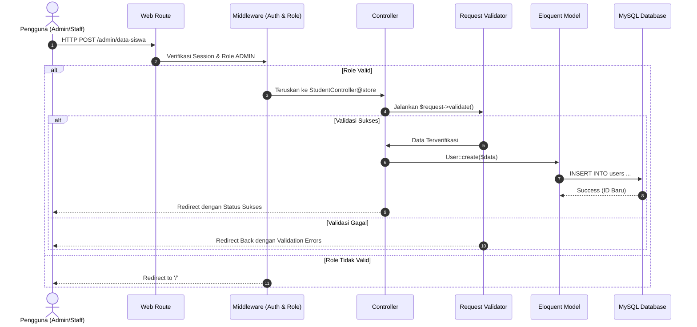

# System Architecture Document - Aplikasi Pembayaran SPP

## 1. Ringkasan Arsitektur
Aplikasi **Pembayaran SPP** dibangun menggunakan pola arsitektur **MVC (Model-View-Controller)** yang disediakan oleh framework **Laravel 8.x**.

```
               +----------------------------------+
               |            HTTP Request          |
               +----------------------------------+
                                |
                                v
               +----------------------------------+
               |       Routing & Middleware       |
               | (web.php, IsAdmin, IsStaff, etc.)|
               +----------------------------------+
                                |
                                v
               +----------------------------------+
               |           Controllers            |
               |   (Admin, Staff, Student Namespaces)
               +----------------------------------+
                     /          |          \
                    v           v           v
             +----------+  +----------+  +----------+
             |  Models  |  | Validation| |  Views   |
             | (Eloquent)| | (Validate)| | (Blade)  |
             +----------+  +----------+  +----------+
                  |                         |
                  v                         v
             +----------+            +--------------+
             | Database |            | Browser Response
             | (MySQL)  |            +--------------+
             +----------+
```

---

## 2. Struktur Direktori Proyek

- **`app/Http/Controllers/`**: Controller aplikasi yang dipisah berdasarkan ruang lingkup peran:
  - `Admin/`: DashboardController, ClassController, StaffController, StudentController, SppController.
  - `Staff/`: DashboardController, SppController.
  - `Student/`: DashboardController, SppController.
  - `Auth/`: AuthenticatedSessionController, RegisteredUserController, dll.
- **`app/Http/Middleware/`**: Middleware pengaman request (`Authenticate`, `IsAdmin`, `IsStaff`, `IsStudent`, `EnsureUserRole`, `RedirectIfAuthenticated`).
- **`app/Models/`**: Model Eloquent (`User`, `Classes`, `Payments`, `Spp`).
- **`database/migrations/`**: Skema tabel basis data.
- **`routes/web.php`**: Definisi routing web utama.
- **`resources/views/`**: Blade template views yang terbagi atas layout admin, staff, student, dan halaman publik.

---

## 3. Alur Otentikasi & Otorisasi (Authentication & Authorization Flow)

1. **Login Flow**:
   - Pengguna mengakses `/login` -> memasukkan kredensial (email/username & password).
   - `AuthenticatedSessionController@store` mengautentikasi kredensial.
   - Aplikasi mengarahkan pengguna ke `/auth`.
   - Route `/auth` membaca atribut `$user->roles` dan mengarahkan secara dinamis:
     - Role `ADMIN` -> `/admin/dashboard`
     - Role `STAFF` -> `/staff/dashboard`
     - Role `STUDENT` -> `/student/dashboard`

2. **Middleware Guard Flow**:
   - Setiap route group dilindungi oleh middleware kombinasi: `['auth', 'admin']`, `['auth', 'staff']`, atau `['auth', 'student']`.
   - Jika pengguna non-admin mencoba mengakses `/admin/dashboard`, middleware akan memblokir request dan mengembalikan response redirect ke halaman utama `/`.

---

## 4. Alur Manajemen Data & Validasi


