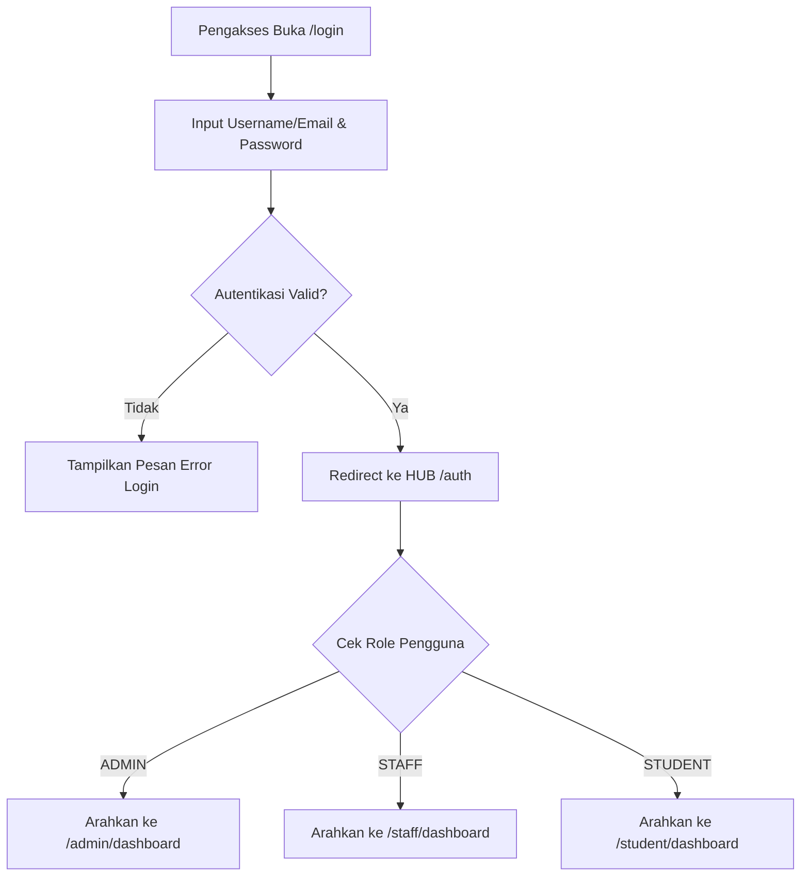
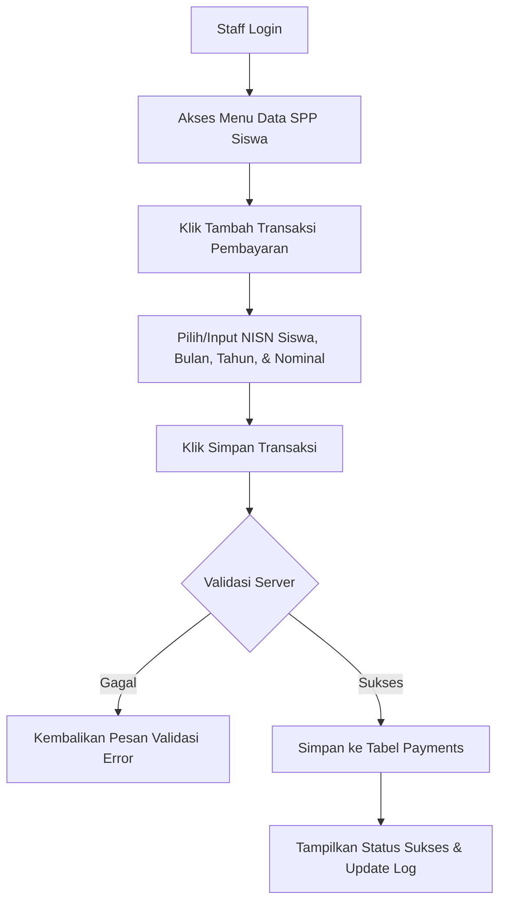

# Product Requirement Document (PRD) - Aplikasi Pembayaran SPP

## 1. Visi Produk
Aplikasi **Pembayaran SPP** adalah platform pengelolaan keuangan sekolah modern berbasis web yang memberikan pengalaman pengelolaan SPP yang aman, cepat, dan intuitif bagi Admin, Staff/Kasir, maupun Siswa.

---

## 2. User Personas

### 2.1. Pak Budi (Administrator Sekolah)
- **Karakteristik**: Bertanggung jawab atas pengelolaan data akademis dan akun pengguna.
- **Kebutuhan**: Mengelola data siswa, kelas, petugas, dan tarif SPP per tahun ajaran. Memastikan seluruh data pengguna terstruktur dan aman.

### 2.2. Ibu Siti (Staff / Kasir SPP)
- **Karakteristik**: Melayani pembayaran SPP harian siswa di kasir sekolah.
- **Kebutuhan**: Form entri transaksi yang sederhana, responsif, dan bebas dari error pencatatan.

### 2.3. Andi (Siswa / Student)
- **Karakteristik**: Siswa yang ingin mengetahui status pembayaran SPP pribadinya.
- **Kebutuhan**: Portal mandiri untuk mengecek bulan mana saja yang sudah dibayar tanpa perlu mendatangi kasir sekolah.

---

## 3. Matriks Fitur & Modul Utama

| Modul | ID Fitur | Nama Fitur | Deskripsi | Akses Role |
| :--- | :--- | :--- | :--- | :--- |
| **Auth** | F-01 | Multi-Role Login | Login terpusat berbasis username/email & password | All (Guest) |
| **Auth** | F-02 | Dynamic Redirection | Pengarahan otomatis ke dasbor sesuai role pengguna (`/auth`) | Auth User |
| **Auth** | F-03 | Secure Logout | Destruksi sesi login dan cookie aman | Auth User |
| **Master** | F-04 | CRUD Data Kelas | Tambah, lihat, ubah, dan hapus data kelas & kompetensi keahlian | Admin |
| **Master** | F-05 | CRUD Data Siswa | Tambah, lihat, ubah (termasuk reset password), dan hapus data siswa | Admin |
| **Master** | F-06 | CRUD Data Petugas | Tambah, lihat, ubah, dan hapus akun staff/kasir | Admin |
| **Master** | F-07 | CRUD Tarif SPP | Pengaturan tarif nominal SPP per tahun ajaran | Admin |
| **Transaksi**| F-08 | Entri Pembayaran SPP | Pencatatan pembayaran SPP siswa (NISN, Nama, Bulan, Tahun, Nominal) | Admin, Staff |
| **Portal** | F-09 | Histori SPP Personal | Melihat riwayat transaksi pembayaran SPP pribadi (terproteksi IDOR) | Student |

---

## 4. User Flow & Process Diagram

### 4.1. Authentication & Role Redirection Flow

### 4.2. Transaksi Pembayaran SPP oleh Staff/Admin

---

## 5. User Stories & Acceptance Criteria

### US-01: Login Terpusat
- **Sebagai** Pengguna Sistem (Admin/Staff/Siswa)
- **Saya ingin** login melalui satu form utama menggunakan kredensial saya
- **Kriteria Penerimaan**:
  - Sistem mengarahkan otomatis ke dasbor sesuai peran setelah login.
  - Jika kredensial salah, tampilkan indikator kesalahan tanpa membocorkan detail spesifik.

### US-02: Entri Pembayaran SPP
- **Sebagai** Staff Kasir
- **Saya ingin** mencatat pembayaran SPP siswa
- **Kriteria Penerimaan**:
  - Input transaksi mencakup NISN, Nama Siswa, Bulan, Tahun, dan Nominal.
  - Data yang tersimpan langsung dapat dilihat di histori siswa terkait.

### US-03: Portal Self-Service Siswa
- **Sebagai** Siswa
- **Saya ingin** melihat riwayat pembayaran SPP saya secara mandiri
- **Kriteria Penerimaan**:
  - Siswa hanya dapat melihat data pembayaran milik NISN/user ID sendiri (Proteksi IDOR).
  - Siswa tidak memiliki akses ke fitur edit atau hapus data.
