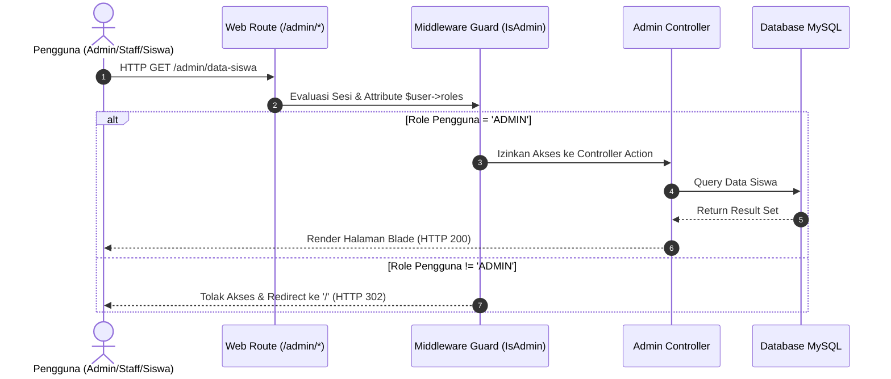

# System Architecture Document - Aplikasi Pembayaran SPP

## 1. Arsitektur Sistem Utama
Aplikasi **Pembayaran SPP** menerapkan pola arsitektur **Model-View-Controller (MVC)** terintegrasi dengan middleware guard layer berbasis framework **Laravel 8.x**.

```
               +----------------------------------+
               |            HTTP Request          |
               +----------------------------------+
                                |
                                v
               +----------------------------------+
               |       Routing & Middleware       |
               | (web.php, IsAdmin, IsStaff, etc.)|
               +----------------------------------+
                                |
                                v
               +----------------------------------+
               |           Controllers            |
               | (Admin, Staff, Student Namespaces)|
               +----------------------------------+
                     /          |          \
                    v           v           v
             +----------+  +----------+  +----------+
             |  Models  |  | Validation| |  Views   |
             | (Eloquent)| | (Validate)| | (Blade)  |
             +----------+  +----------+  +----------+
                  |                         |
                  v                         v
             +----------+            +--------------+
             | Database |            | Browser Response
             | (MySQL)  |            +--------------+
             +----------+
```

---

## 2. Tech Stack & Environment

| Layer | Teknologi / Library | Keterangan |
| :--- | :--- | :--- |
| **Language Runtime** | PHP 8.2+ / 8.3 | Dioptimalkan untuk performa & dependensi modern |
| **Framework** | Laravel 8.x | Framework PHP berbasis MVC |
| **Database** | MySQL 8.0 / MariaDB | Relational Database Management System |
| **Frontend UI** | Blade Templating, Bootstrap / Stisla | Responsive Admin UI Dashboard |
| **Build & Tooling** | Laravel Mix, Webpack, Composer 2.x | Asset Bundling & Dependency Manager |
| **Testing** | PHPUnit 9.x | Automated Unit & Feature Testing |
| **Containerization** | Docker, Docker Compose | Deployment & Container Environment |

---

## 3. Struktur Direktori Utama

- **`app/Http/Controllers/`**: Controller dipisah berdasarkan ruang lingkup peran pengguna:
  - `Admin/`: `ClassController`, `StaffController`, `StudentController`, `SppController`, `DashboardController`.
  - `Staff/`: `SppController`, `DashboardController`.
  - `Student/`: `SppController`, `DashboardController`.
  - `Auth/`: `AuthenticatedSessionController`, `RegisteredUserController`.
- **`app/Http/Middleware/`**: Middleware pengaman request (`Authenticate`, `IsAdmin`, `IsStaff`, `IsStudent`, `EnsureUserRole`, `RedirectIfAuthenticated`).
- **`app/Models/`**: Entitas Eloquent (`User`, `Classes`, `Payments`, `Spp`).
- **`database/migrations/`**: Skema migrasi basis data.
- **`routes/web.php`**: Route definisi aplikasi.
- **`resources/views/`**: Template Blade yang terorganisir per role pengguna.

---

## 4. Middleware & Role-Based Access Control (RBAC) Flow



---

## 5. Security & Refactoring Layer Design
1. **Unified User Entity**: Seluruh peran (`ADMIN`, `STAFF`, `STUDENT`) tersimpan dalam satu tabel `users` dengan kolom `roles`, menyederhanakan autentikasi dan eliminasi kelas duplikat.
2. **IDOR Scoping**: Controller portal siswa menerapkan filter eksplisit berbasis `Auth::user()->id` dan `Auth::user()->nisn`.
